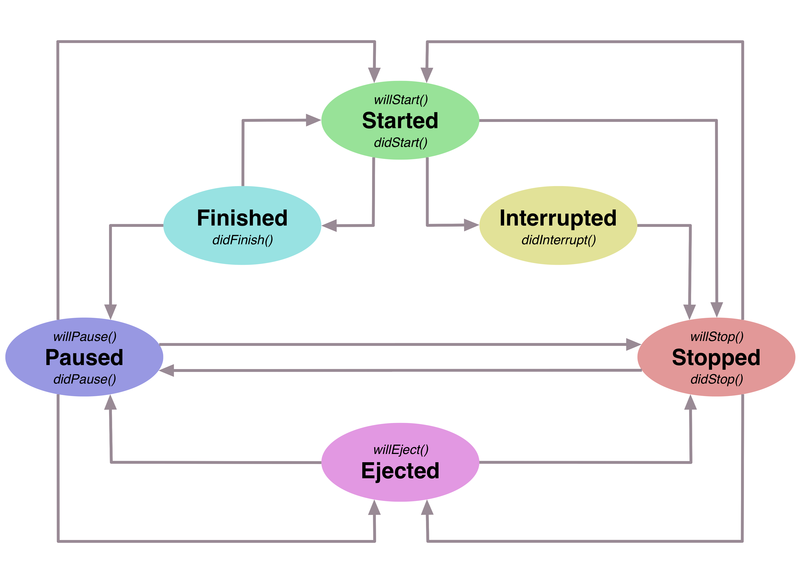

# kjob-apple
Utility for asynchronous job in iOS, macOS, tvOS and watchOS apps.

[]() 
[]() 
[]() 
[]() 
[]() 
[](https://github.com/Carthage/Carthage)

Library contains class `Job` which provides different utilities for asynchronous job. `Job` object incapsulates a command chain where each command may be executed in thread with necessary priority.
There is a posibility to suspend commands and cancel commands from job chain.

## Basic commands

For sake of facilitation, library include static methods which duplicate instance methods, for example code

```swift
let job = Job.doingInBackground {
    // do something
}
```
performs standalone actions in thread with `DispatchQoS.QoSClass.background` priority and code

```swift
job.doInBackground {
    // do something
}
```

do the same thing. Every method returns `Job` object, so you can easily make up command chains like that:

```swift
Job.doingInBackground {
    // do something in thread with DispatchQoS.QoSClass.background priority
}.doInMain {
	// do something in main thread
}.doInUtility {
    // do something in thread with DispatchQoS.QoSClass.utility priority
}
```

We may execute commands with delay like that

```swift
Job.doingInBackground(delay: 2.0) {
    // do something with delay for 2 seconds
}
```

We may await when the last command in the job will be completed:

```swift
let job = Job.doingInBackground {
    // do action 1
}.doInMain {
	// do action 2
}.await()
// do something after action 2 is completed
```

Also we may await for not more then specified amount of seconds:

```swift
job.doInBackground {
    // do action 3
}
job.doInMain {
	// do action 4
}
let waited = job.await(10.0)
// do something after action 4 is completed or after 10 seconds
```

Method `await` returns boolean value which means whether we waited the complition of the last command or not.

You may add and remove custom tagged queues globally like that:

```swift
Job.addQueue(tag: "CUSTOM_QUEUE_TAG", priority: .background)
...
Job.removeQueue(tag: "CUSTOM_QUEUE_TAG")
```

After we added custom tagged queue we may refer to this queue from different job instances:

```swift
let job1: Job = ...
let job2: Job = ...

job1.doInCustom("CUSTOM_QUEUE_TAG") {
    // do action 1
}

job2.doInCustom("CUSTOM_QUEUE_TAG") {
    // do action 2 after action 1 is completed
}
```

In this case `action 2` will be executed only after `action 1` because we do this actions in the same custom queue tagged with `"CUSTOM_QUEUE_TAG"`.

Along with standalone actions there are some special types of commands.

### Target-Action commands

We can perform actions on specified targets

```swift
Job.addTarget(TargetA.sharedInstance)
Job.addTarget(TargetB.sharedInstance)

Job.doingInBackground { (target: TargetA) in
    // do something with target A
}.doInMain { (target: TargetB) in
    // do something with target B
}
```

As you can see we added target A and target B so that we might do actions on this targets. 

If we had not added any target to `Job` or we had removed any target after addition, action would not have been performed on this target.

```swift
Job.addTarget(TargetA.sharedInstance)

// this action will be executed because we added target A
let job = Job.doingInBackground { (target: TargetA) in
    // do something with target A
}

Job.removeTarget(TargetA.sharedInstance)

// this action will not be executed because we remvoved target A
job.doInMain { (target: TargetA) in
    // do something with target A
}

// this action will not be executed because we did not add target B
job.doInBackground { (target: TargetB) in
    // do something with target B
}
```

### Event-Action commands

We can perform actions on specified events

```swift
Job.addAction(Action({ (event: EventA) -> Void in
    // do something with event A
}))
Job.addAction(Action({ (event: EventB) -> Void in
    // do something with event B
}))

Job.postingInBackground(event: EventA())
.postInMain(event: EventB())
```

As you can see we added actions for event A and event B so that we might post this events. 

If we had not added action for any event to `Job` or we had removed action for any event after addition, action would not have been performed for this event. 

```swift
let action = Action({ (event: EventA) -> Void in
    // do something with event A
})
Job.addAction(action)

// action for this event will be executed because we added action for event A
let job = Job.postingInBackground(event: EventA())

Job.removeAction(action)

// action for this event will not be executed because we removed action for event A
job.postInMain(event: EventA())

// action for this event will not be executed because we din not add action for event B
job.postInBackground(event: EventB())
```

## Job lifecycle

Every job instance has it's own lifecycle with different states.



If you inherit `Job` class you can use handy self-descriptive job callbacks inforiming you about job state transitions:

```swift
class MyJob : Job {
    
    init() {
        super.init(mode: .auto)
    }
    
    override func willStart() {
        //Job will start
    }
    
    override func didStart() {
        //Job did start
    }
    
    override func didFinish() {
        //Job did finish
    }
    
    override func willPause() {
        //Job will pause
    }
    
    override func didPause() {
        //Job did pause
    }
    
    override func didInterrupt() {
        //Job did interrupt
    }
    
    override func willStop() {
        //Job will stop
    }
    
    override func didStop() {
        //Job did stop
    }
    
    override func willEject() {
        //Job will eject
    }
    
}
```

Lifecycle begins and ends with `Ejected` state. While creating of `Job` object it's state changes from `Ejected` state to `Paused` or `Stopped` state. It depends on `Job.Mode` which you may specify in `Job` constructor like that:

```swift
let autoJob = Job(mode: .auto)
let manualJob = Job(mode: .manual)
```
 
All auxiliary static methods like `Job.doingInBackground` create jobs in `.auto` mode under the hood. While creating job in `.auto` mode, job's state becomes `Paused`, but creating job in `.manual` mode, job's state becomes `Stopped`. If you call methods like `Job.doInUtility` in `Paused` state, commands are launched immediately and job state changes to `Started`. In `Stopped` state these methods only add new commands to job and you need to call `Job.resume` method in order to launch commands:

```swift
let manualJob = Job(mode: .manual)
manualJob.doInBackground {
    // do something
}
manualJob.resume()
```

In `Started` state job try to execute the first command from it's queue. If command execution is succeeded job state changes to `Finished`, command is dequeued and job try to pick up next command to execute. If there is commands which is ready to be executed, job states changes to `Started` and all process proceeds until there is no command in command queue or some command execution is failed. In case of successful complition of all commands, job state changes to `Paused`. If some command execution is failed, job state changes to `Stopped` and you can pick up an occurred error like that:

```swift
let error: Error = job.error()
```

After that you can resume job in order to relaunch this failed command:

```swift
job.resume()
```

or you can cancel all commands like that:

```swift
job.cancel()
```

If you resume stopped job and there is no command to execute job state changes to `Paused`, but if job has commands for execution job state changes to `Started` and job try to execute all these commands one-by-one. If job is started or paused, you can suspend job like that:

```swift
job.suspend()
```

If job was paused before suspending, job state just changes to `Stopped`, but if job was started - job state changes to `Interrupted` and job awaits when current command will be executed. If command execution is succeeded command is dequeued but if command execution is failed command remains in job. After current command execution is completed job state changes to `Stopped`.
